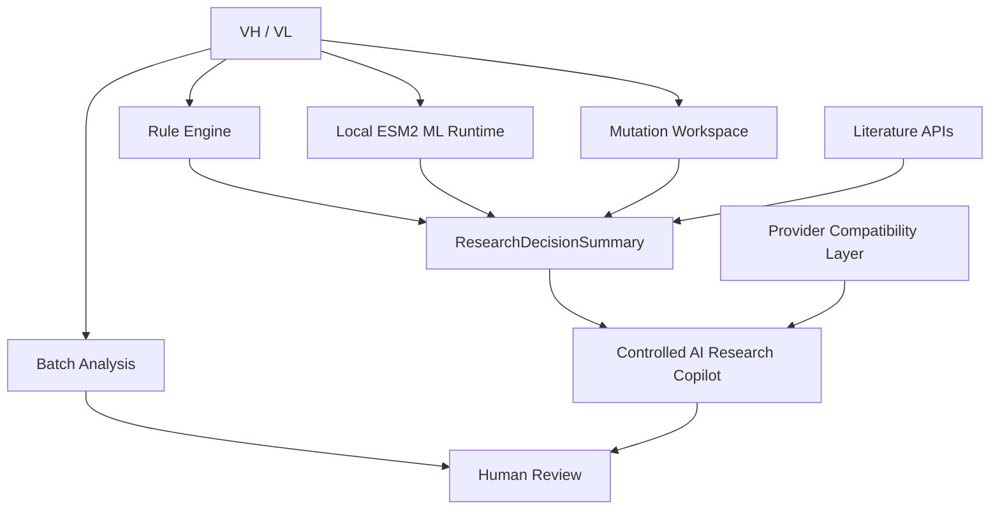

# Antibody Research Decision-Support Workbench

**v4.0.0** · local-first antibody sequence, evidence, and experimental-property research workbench

This project supports antibody research workflows that combine sequence
liability screening, local experimental-property model estimates, mutation
hypothesis comparison, literature evidence, structured research summaries,
and controlled AI explanation. It is decision support for human and wet-lab
review, not an autonomous scientific decision-maker.

## What it does

- **Single Analysis**: paired VH/VL sequence validation, CDR/framework-aware
  PTM and chemical-liability motif scanning, and deterministic rule scoring.
- **Batch Analysis**: CSV, XLSX, and FASTA import with flexible column mapping,
  chain inference, per-chain analysis, and CSV/XLSX export.
- **Mutation Workspace**: validate a mutation, compare original and mutant
  rule findings, and inspect arithmetic ML estimate deltas.
- **Literature Evidence**: Europe PMC/PubMed search, relevance labeling,
  evidence provenance, and citation-identifier validation.
- **Experimental ML Estimates**: local ESM2-based HIC and frozen benchmark
  composite estimates when local model artifacts are prepared.
- **Research Decision Summary**: deterministic aggregation of already-produced
  evidence with fingerprints and stale-state protection.
- **Controlled AI Research Copilot**: an explicit, asynchronous explanation
  layer grounded in the current Research Decision Summary.
- **Provider compatibility**: DeepSeek, OpenAI, OpenAI-compatible endpoints,
  Ollama, and Mock backends.

## Scientific scope and boundaries

The rule engine identifies predefined sequence liabilities such as
deamidation, isomerization, oxidation, N-glycosylation motifs, and selected
heuristic candidates. The calculated rule score is a prioritization score:

> **Higher calculated score = lower calculated rule penalty.**

It is not a probability, experimental measurement, global developability
score, clinical predictor, efficacy predictor, affinity predictor, or wet-lab
replacement. CDR weighting and heuristic PTM candidates remain computational
rules and require experimental verification.

The ESM2 models estimate selected experimental properties from a frozen,
internal AIntibody benchmark. Rule findings and ML estimates are separate
evidence layers; the product does not create an overall combined score.

## Quick Start — Windows PowerShell

Use a supported Python installation and a PowerShell terminal:

```powershell
git clone <repository-url>
cd antibody-risk-assessment
py -3.10 -m venv .venv
.\.venv\Scripts\Activate.ps1
python -m pip install --upgrade pip
python -m pip install ".[desktop]"
python -m desktop.main
```

Provider configuration is optional. Rule analysis, batch analysis, mutation
rule comparison, literature retrieval, and local summaries do not require an
AI-provider key. To enable the optional Provider/Agent path, install the
corresponding extras and configure credentials locally, never in Git:

```powershell
python -m pip install ".[agent]"
```

For the local ESM2 workflow, install the optional ML/ESM2 dependencies:

```powershell
python -m pip install ".[dl]"
```

The frozen deployment-model builder is:

```powershell
python validation/run_build_deployment_models.py
```

This command reads the frozen Phase 5 TRAIN + VALIDATION inputs and local
frozen ESM2 embeddings, then creates these ignored local artifacts:

- `artifacts/ml_models/hic_esm2_v1.joblib`
- `artifacts/ml_models/developability_esm2_v1.joblib`
- `artifacts/ml_models/model_manifest.json`

The builder does not use the frozen TEST rows. The raw validation datasets,
embedding files, and model binaries are not shipped as ordinary Desktop
release files; maintainers need the corresponding local validation bundle to
rebuild them. The build is reproducible and records artifact hashes in the
manifest.

The frozen ESM2 representation is
`facebook/esm2_t30_150M_UR50D` at revision
`a695f6045e2e32885fa60af20c13cb35398ce30c`. The first live ESM2 load may
download weights into the Hugging Face cache, so network access can be needed
once. Subsequent cached inference is local. CUDA is optional; CPU fallback and
the frozen float32 representation are supported. No inference-speed guarantee
is made.

## Current workflow

```text
Paired VH/VL
    ↓
Sequence Liability Screening
    ↓
Experimental ML Estimates
    ↓
Mutation Hypothesis Comparison
    ↓
Literature Evidence
    ↓
Research Decision Summary
    ↓
Controlled AI Research Copilot
    ↓
Human / Experimental Decision
```

Batch Analysis is a parallel screening workflow for many antibody records;
its outputs do not silently become evidence for another open analysis.

## Production architecture



Validation is separate from ordinary Desktop inference:


Validation datasets are not required for ordinary Desktop inference after
deployment artifacts have been built.

### Module map

| Area | Main responsibility |
| --- | --- |
| `core.py` | Sequence validation, CDR annotation, liability/PTM scanning, mutation rescan |
| `scoring.py` | Deterministic rule-based prioritization score |
| `input_parser.py`, `batch_analysis.py` | Batch input normalization and per-chain analysis |
| `desktop/` | PySide6 Desktop workflow, state, workers, adapters, and evidence views |
| `ml_inference/` | Lazy local inference for the frozen ESM2 deployment models |
| `literature/` | Europe PMC/PubMed evidence retrieval, relevance, and citation validation |
| `agent/` | Provider abstraction, tool calling, fact boundaries, and orchestration |
| `validation/` | Isolated dataset, benchmark, and reproducibility code; not product logic |

## Local versus network behavior

| Workflow | Runs locally? | May use network? | What may leave the machine? |
| --- | --- | --- | --- |
| Rule Analysis | Yes | No | Nothing |
| Mutation Rule Analysis | Yes | No | Nothing |
| Batch Analysis | Yes | No | Nothing |
| Research Decision Summary | Yes | No | Nothing |
| Cached ESM2/model inference | Yes | No | Nothing |
| Initial ESM2 model retrieval | Local after retrieval | Yes, Hugging Face retrieval | Sequence analysis is not sent to a Provider; model files are retrieved |
| Literature search | Partly | Yes, Europe PMC/PubMed | Search query and API request metadata |
| Remote AI Provider | No | Yes | The configured structured prompt/context; credentials stay local |
| Local Ollama | Yes | Local service only | Data stays on the configured local machine/service |
| AI Research Copilot | Summary generation is local UI work | Provider-dependent | Structured Research Summary context; full VH/VL is not included by default |

The `.env` file, keyring entries, API keys, tokens, and private certificates
must remain local. See [`docs/REAL_LLM_SETUP.md`](docs/REAL_LLM_SETUP.md) for
provider setup details.

## Scientific validation

The frozen validation work is documented in
[`validation/PHASE5_ML_BENCHMARK_SUMMARY.md`](validation/PHASE5_ML_BENCHMARK_SUMMARY.md)
and [`validation/PHASE5_TEST_EVALUATED.md`](validation/PHASE5_TEST_EVALUATED.md).

- **Jain 2017**: broad current-rule associations were largely weak or null.
- **AIntibody**: assay-specific oxidation/HIC relationships emerged.
- **HIC / ESM2 frozen held-out evidence**: Spearman rho `0.834662`, R²
  `0.625834`, N=`72`.
- **Composite / ESM2 frozen held-out evidence**: PR-AUC `0.611665`, ROC-AUC
  `0.691468`, N=`95`.

**Critical limitation:** 84/95 TEST sequences had paired-min sequence identity
≥0.90 to TRAIN. This does **not** establish family-independent generalization.
The TEST set has been observed once under the frozen protocol and cannot be
reused as a new untouched final test.

The frozen benchmark supports research-property estimation within its tested
scope; it does not establish universal developability prediction, clinical
utility, causal mutation effects, or family-independent performance.

## Research Summary and Copilot boundaries

The Research Decision Summary is deterministic. It aggregates existing
evidence and does not run an LLM, rerun rules, rerun ML, search Literature,
create an overall score, or create a final recommendation.

The Copilot is an explicit, asynchronous explanation layer for the current
summary. It uses the configured Provider, does not receive full raw VH/VL by
default, validates DOI/PMID/PMCID identifiers against current evidence, and
blocks selected unsupported recommendation/generalization language. It does
not call scientific tools, automatically search Literature, rerun ML, replace
the deterministic summary, or act as the scientific source of truth.

See [`docs/RESEARCH_DECISION_SUMMARY.md`](docs/RESEARCH_DECISION_SUMMARY.md)
and [`docs/AI_RESEARCH_COPILOT.md`](docs/AI_RESEARCH_COPILOT.md).

## Tests

The normal application suite excludes tests marked `live` by default:

```powershell
python -m pytest -q
python -m pytest validation/tests -q
python -m pytest validation/tests/test_ml_inference_runtime.py -q
```

The v4 baseline is 528 passed, 4 deselected, 5 warnings for the application
suite; validation is 139 passed and the ML runtime suite is 10 passed. Live
network tests require an explicit `python -m pytest -m live` invocation.

## Documentation and safe demo

- [`docs/V4_DEMO_WALKTHROUGH.md`](docs/V4_DEMO_WALKTHROUGH.md) — concise
  Desktop walkthrough and later screenshot checklist.
- [`docs/RELEASE_NOTES_V4.md`](docs/RELEASE_NOTES_V4.md) — v4.0 release notes.
- [`docs/PROJECT_INTERVIEW_GUIDE.md`](docs/PROJECT_INTERVIEW_GUIDE.md) —
  technically grounded interview Q&A.
- [`docs/ML_MODEL_CARD.md`](docs/ML_MODEL_CARD.md) — frozen local ML model
  card.
- [`validation/PHASE5_ML_BENCHMARK_SUMMARY.md`](validation/PHASE5_ML_BENCHMARK_SUMMARY.md)
  — frozen benchmark summary.
- [`validation/PHASE5_TEST_EVALUATED.md`](validation/PHASE5_TEST_EVALUATED.md)
  — one-time TEST evaluation marker.

For a safe synthetic/reference walkthrough, use the tracked
`example_antibodies.csv`. Do not place private sequences, credentials, or
benchmark TEST labels in screenshots, examples, or issue reports.

## Portfolio perspective

This repository demonstrates:

- **Engineering**: Python, PySide6 Desktop UI, asynchronous workers, provider
  abstraction, local inference, structured state, tests, and selective Git
  discipline.
- **Scientific ML**: antibody sequence liabilities, PTM/CDR reasoning, public
  experimental datasets, confounder analysis, Protein LM representation,
  held-out evaluation, and explicit model limitations.
- **AI / Agent**: literature evidence, structured provenance, fact boundaries,
  and controlled LLM explanation with privacy constraints.

The project deliberately makes modest scientific claims. Human review and
experimental confirmation remain required.
